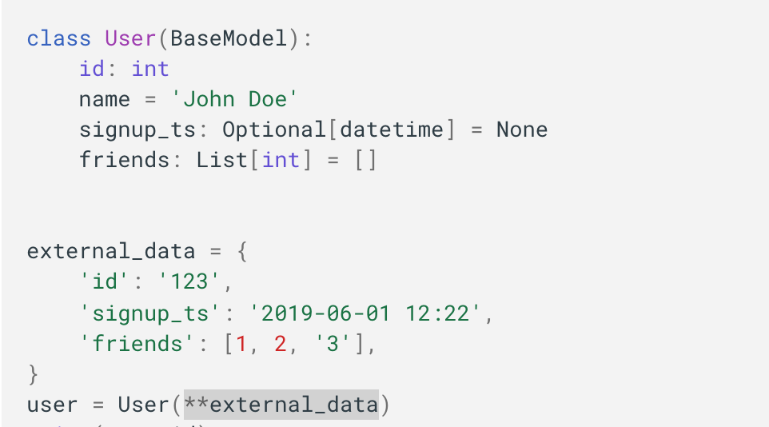

## 들어가며
개발하며 이런 식의 표현을 보았습니다.

이런 식의 표현은 함수를 정의하면서 keyword argment 자리를 표현할때 종종 사용하고는 했습니다.
근데 정의할 때가 아니라 사용할 때 이런식으로 쓰면 어떻게 되는건지 궁금해졌습니다. 그냥 넣는거랑 **을 붙이는거랑 무슨 차이가 나는걸까요?

데이터를 Unpacking 하는 용도로 쓰인다고 합니다.

## 데이터 언패킹 사용예시
User 에서 id, signup_ts, friends 를 keyword argument 로 받는 경우,
Dictionary 타입으로 정의된 객체를 그대로 인자로 전달하고 싶을 때 사용하면 좋습니다.

## Python의 Asterisk(*) 사용 예시 알아보기
- [파이썬의 Asterisk(*) 이해하기 · mingrammer’s note](https://mingrammer.com/understanding-the-asterisk-of-python/)
- [5 Uses of Asterisks in Python. The powerful weapon for writing more… | by Yang Zhou | TechToFreedom | Medium](https://medium.com/techtofreedom/5-uses-of-asterisks-in-python-3007911c198f)

