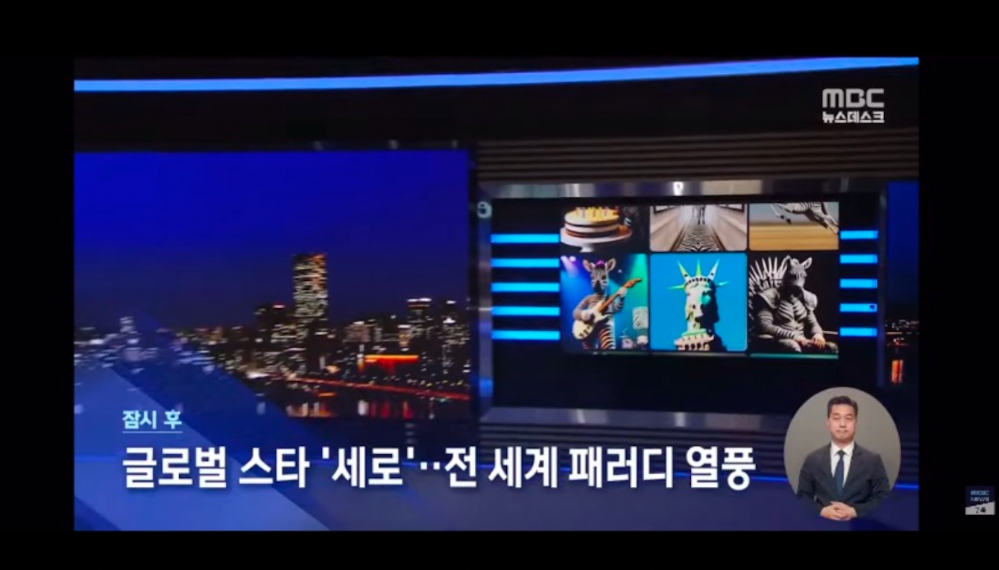
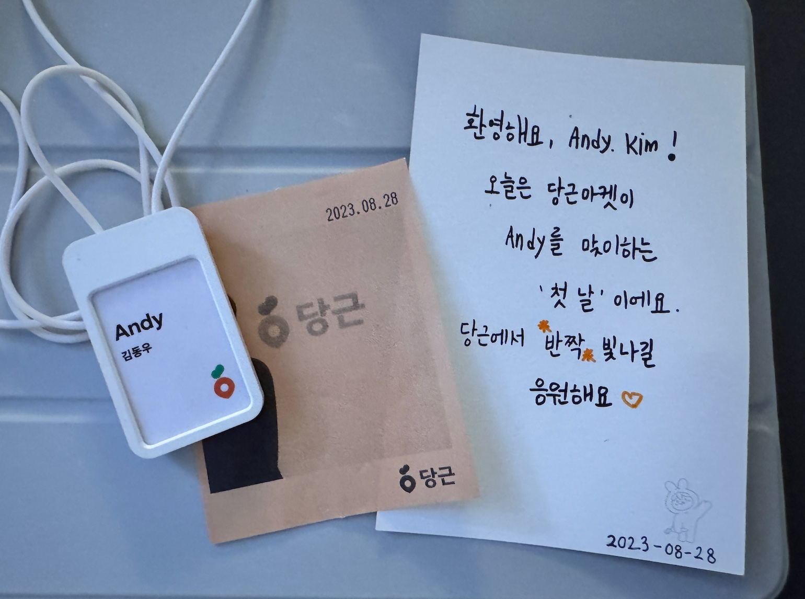

[창업 활동을 잠시 마무리 하며](https://kimdongwoo.medium.com/%EC%B0%BD%EC%97%85-%ED%99%9C%EB%8F%99%EC%9D%84-%EC%9E%A0%EC%8B%9C-%EB%A7%88%EB%AC%B4%EB%A6%AC-%ED%95%98%EB%A9%B0-ca9fb0c16540) 라는 글을 공유한지 벌써 4년이 되어갑니다. 돌아보면 팬데믹이 마무리되어가는 시기였지만 마스크를 쓰지 않는 것이 어색했는데, 이제는 오래 전 이야기가 된 것만 같은 느낌입니다.

6년 전 창업에 뛰어들며 학교를 휴학했습니다. 3년 전 병역 이행을 위해 취업을 결정하여 AI 스타트업에 데이터 연구원으로 취업했고, 최근에는 당근에서 데이터 분석가로 1년 반이 넘는 시간을 보낼 수 있었습니다. 회사 생활은 너무 만족스러웠고 커리어의 발전도 기대할 수 있는 좋은 상황이였습니다. 하지만 저는 이제 대책 없이 퇴사해서 온전한 대학생으로 돌아간다는 결정을 했습니다.

어쩌다 이런 결정을 하게 되었는지, 그간 지난 회사생활을 돌아보며 배운 점, 그리고 앞으로의 계획을 공유해봅니다.

---

2022년 1월달에 처음으로 제 이름으로 된 이력서를 작성하고 제출했던 순간이 기억납니다. 
그때까지는 어떻게 하면 좋은 면접을 진행할 수 있을지는 고민해봤어도 어떻게 대답해야 좋은 지원자로 보일 수 있을지는 고민해보지 못했습니다.

당시 가장 가고 싶었던 회사에 지원서를 제출하고 일주일만에 3차 최종 면접까지 보았습니다. 첫번째 면접을 보고 내가 진짜 회사에서 가치를 만 들어 낼 수 있는 사람인지 의심을 해보기 시작했습니다. 내 기준에서 가치가 아닌 남들이 바라보는 나의 가치가 정말 있는지 궁금해졌습니다. 그렇게 고민하던 와중에 저의 회사생활이 시작되었습니다.

### 라이언로켓에서 배운 것 

제가 살면서 처음으로 온전한 채용 과정을 거쳐 팀원으로 합류하게 된 회사는 생성형 AI 기술을 상용화하여 콘텐츠 시장을 혁신하려는 스타트업인 라이언로켓이였습니다. 요즘은 누구에게나 익숙한 생성형 AI도메인을 남들보다 1년정도 빠르고 깊게 경험할 수 있었습니다. 데이터 연구원 포지션으로서 논문으로 공개된 모델을 실제 상용화하는 과정을 함께했습니다. 

라이언로켓에서 뛰어난 주변 연구원들과 함께 논문을 리뷰하고, 모델을 개선하기 위해 파생되는 아이디어를 토론하며 도메인에 대한 이해를 넓힐 수 있었습니다. 당일에 발표된 논문을 함께 리뷰하며 정말 기술의 첨단이 무엇인지를 알 수 있었습니다.

라이언로켓에서 직무적으로 배운 것은,  “무엇이든 하려면 만들어 낼 수 있구나” 를 알게 된 것입니다.
사람의 눈으로 평가할 수 밖에 없다고 생각했던 “AI모델이 만들어낸 영상으로 만들어진 입 모양과 움직임이 자연스러운가?” 를 어떻게하면 자동으로 평가할 수 있는지부터, “사람은 어떤 얼굴을 아름답다고 느끼는가?“를 정량적으로 수치화하는 도전 과제들을 수행했습니다. CPU와 메모리 로드가 거의 100%에 육박하는 작업을 3일 이상 연속 수행하는 프로그램을 만들어 6개 머신에서 동시에 정상 작동하도록 구현하고 모니터링 하는 일, 몇백 TB규모의 비정형 데이터셋을 직접 수집하고 관리, 모니터링 하는 일 등 그때까지는 상상도 해보지 못한 과제를 기술로써 도전해보며 자신감을 가질 수 있었습니다. 

라이언로켓을 퇴사하기 6개월 전 쯤 전사적으로 새로운 프로덕트에 도전하게 되었습니다. 내부에서 포지션을 변경하여 데이터 분석가 내지는 그로스 PM 역할을 맡았습니다. 유저가 0명이던 순간부터 MAU 10만명을 달성하는 순간까지 전 과정에서 어떻게 제품을 출시하고 성장시킬지 고민할 수 있었습니다. 6명 정도 되는 팀원이 모여 매일 배포하고 가설을 테스트하며 작지만 유의미한 매출도 만들어 볼 수 있었습니다. “일단 만들어보자”라는 원칙을 다시 한번 떠올리는 순간이 되었습니다.

서비스에서 만들어진 콘텐츠가 확산되며 뉴스데스크에 소개되는 재미있는 경험을 하기도 했습니다.

### 당근에서 배운 것

두번째로 경험한 회사는 누구나 아실만한 회사인 당근 입니다. 당근으로 이직 한 후 처음으로 가족모임에서 회사를 소개 할 때 무슨 회사인지 설명하지 않아도 되었습니다. 창업가가 되기로 마음 먹은 이후로 평생동안 큰 회사를 다녀볼 기회가 없을거라고 생각했습니다. 한편으로는, 내가 큰 회사에는 어울리지 않는 사람이라는 두려움도 있었던 것 같습니다. 하지만 지금이 아니면 이런 도전을 해보기 어려울 것 같다는 생각에 지원했고, 정말 좋은 기회로 합류할 수 있었습니다. 당근에서는 전혀 상상도 해보지 못한 광고 플랫폼을 만드는 도메인에서 대부분의 기간동안 유일한 데이터 분석가로 함께했습니다.

당근은 제가 생각하는 가장 이상적인 문화를 가진 회사였습니다. 자율성과 적절한 긴장 사이에서 서로 협력하며 성과를 만들어 내는 조직이 이렇게까지 커질 수 있다는 것을 눈으로 직접 볼 수 있었습니다. 지금이야 익숙하지만 그간 많으면 40명이 되는 조직만 경험해본 저로서는 500명 가까이 되는 구성원이 되는 회사가 이렇게까지 스타트업 정신을 유지할 수 있다는 것이 놀라웠습니다.

당근에서 가장 기억에 남는 기술적인 경험은 역시 4000만명이 넘는 사용자에서 나온 것입니다. 수 많은 유저가 만들어내는 데이터를 다루고, 그 속에서 인사이트를 얻고, 그 인사이트를 바탕으로 실행까지 해본 경험이 가장 인상깊게 남습니다. 당근 입사 전만 해도 데이터베이스가 100만행 정도면 너무 크다고 생각했습니다. 입사 첫날 저에게 PB규모의 데이터셋에 쿼리를 날려야 하는 과제를 주셨을 때 느꼈던 막연한 두려움이 여전히 기억에 남습니다. PB 규모의 전사적인 데이터를 일상적으로 분석하며 동시에 모든 구성원이 비용과 시간 효율적으로 필요한 데이터를 얻어갈 수 있는 환경에 대해 고민하고 실천해볼 수 있는 경험을 했습니다.

제가 속한 팀은 당근에서 거의 대부분의 매출을 담당하는 광고 플랫폼이였습니다. IT 겨울시기 회사의 지속가능성을 책임지는 팀에 속해있으며 “비즈니스 임팩트”에 대한 진정한 경험을 했다는 것도 큰 수확이였습니다. 재무적인 목표를 달성하기 위해 다양한 팀들과 논의과정을 거치고, 또 그 사이의 이해관계를 고려해서 설득하는 과정을 바로 옆에서 볼 수 있었습니다. 광고실 팀 전체가, 더 나아가서는 회사 전체가 협력해서 연간 n배 성장하는 도전과제를 달성해내고 결국 당근의 흑자전환 순간까지 보게 된 것은 너무나 큰 경험이였습니다.

당근에서 무엇보다 기억에 남는 것은 “동료”에 대한 중요함입니다. 정말 뛰어난 동료들과 함께 업무적으로는 도전하며 성장하고, 또 일 외적으로도 다양한 교류를 할 수 있었습니다. 당근에서 잠시나마 면접관으로서 면접과정에 참여할 기회를 얻기도 했는데, 정말 뛰어난 인재밀도를 유지하기 위한 노력이 무엇인지, 또 그 노력이 어떤 결과를 만드는지 알 수 있었습니다.

### 왜 잘 다니는 회사를 그만두는가?
주변 분들이 가장 궁금해 하는 부분입니다. 보통 퇴사를 하는 이유는 지금 상황에 불만족스러운 것이 있거나 더 큰 목표를 달성할 수 있는 곳을 찾아 떠나는 경우가 많습니다. 저에게는 과분할 정도로 만족스러운 환경이였기 때문에 주변에서도 퇴사를 쉽게 이해하기 어려운 것이 이상하지는 않습니다. 심지어 마지막에 있었던 당근은 나름대로 많은 분들이 들어오고 싶어하는 회사이기도 하고, 보상이나 복지 측면에서도 아쉬운 점이 없습니다. 뛰어난 동료들이 많고 해결해야 할 어렵지만 재미있는 문제들도 많기 때문에 스스로도 성장할 수 있는 기회를 많이 얻을 수 있다는 생각도 했습니다. 이러한 좋은 조건들은 더더욱 퇴사하기에는 아까운 상황입니다. 심지어는 회사와 학교를 병행하는 선택지를 얻을수도 있었습니다.

최근에 우연히 컴퓨터 개인 노트를 정리하다가 제가 학생 시절에 적어둔 글들을 보게 되었습니다. 무언가 다시 가슴이 뛰는 느낌이 들었습니다. 제가 쓴 메모들이지만 뭔가 지금의 저와 다른 사람인 것 같은 느낌이 들었습니다.

돌아보니, 회사생활을 하면 할수록 저의 본 모습을 잃어버리고 있었습니다. 사실 처음 병역을 해결하기 위한 회사를 찾을때는 2년만 편하게 다니며 창업준비를 병행하고 곧바로 다시 창업 전선에 뛰어들 생각이었습니다. 그러나 처음으로 받은 제대로 된 월급은 마약과 같았습니다. 매 달 나의 가치를 인정받는 것만 같았습니다. 몇년 뒤의 저의 모습이 상상되기 시작했고 안정적인 미래가 보이는 것 같았습니다. 이대로 회사생활을 하며 집을 얻고, 결혼해서 아이들과 함께 40살 50살이 될 때까지 커리어를 보낼 수 있을 것만 같았습니다. 

원래 저의 인생 목표와는 다르게 이처럼 안정적인 삶이 인생의 목표로 변해가고 있는 저를 스스로 인지조차 할 수 없었던 것 같습니다.
회사를 다니고 이직을 하며 직무적으로는 크게 성장하고 있었을지 몰라도 인간적으로는 컴포트존으로 빨려들어가고 있다는 것을 깨닫는 순간이였습니다.

---

무언가 채우기 위해선 비워내는 시간이 필요하다는 것을 창업 시절을 포함하여 지난 6년동안 치열하게 배웠습니다.
앞으로 1년간은 의도적으로 비워내는 시간을 가지도록 노력하려합니다. 바쁘지 않은 삶 속에서 더 많은 고민을 하고 미래를 그려보려고 합니다. 
감사하게도 고민거리를 많이 던져주는 환경인 대학수업을 원없이 들을 수 있게 되었으니 이러한 순간을 잘 활용해보겠습니다.

그 다음은 아직 모르겠습니다! 여전히 하고 싶은 것이 너무나 많습니다. 지금으로서는 회사를 어떻게 하면 최대한 늦게 들어갈 수 있을지 고민중입니다. 제 회사를 차리는 것도 회사에 들어가는 것이라고 생각합니다. AI의 혁명으로 노동 구조와 경제 구조가 많이 바뀔 것 같습니다. 이러한 상황에서 새로운 삶의 구조를 먼저 도전해보고 싶다는 생각을 가지고 있습니다.

---

돌아보니 지난 3년동안 꿈을 꾸고 돌아왔다는 생각이 드네요. 그동안 함께해주신 모든 분들에게 감사드리며, 앞으로도 잘 부탁드립니다 😌
