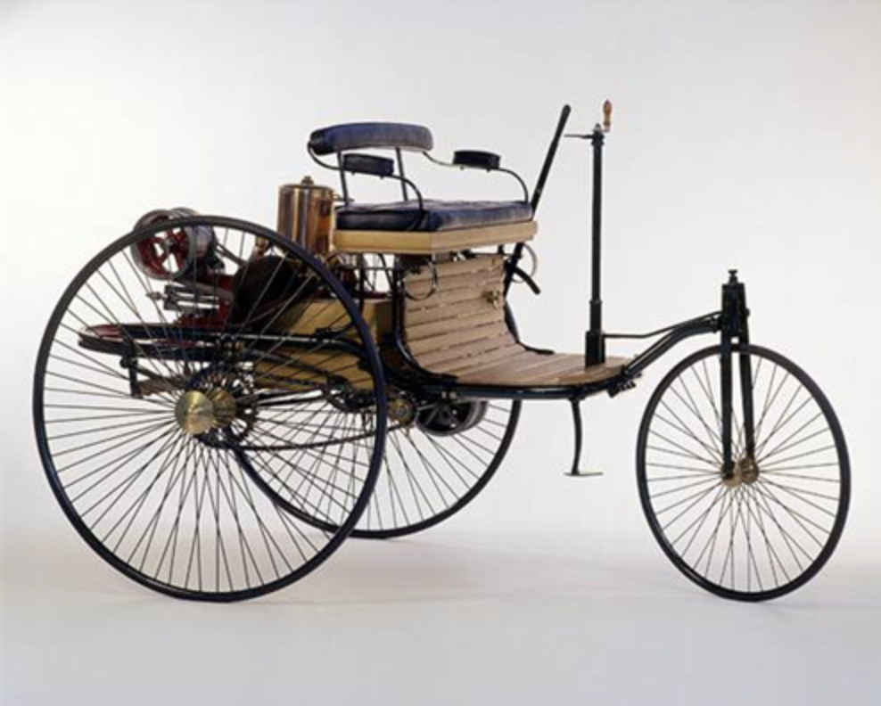
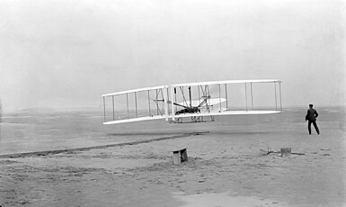

기술의 발전속도는 빠르다. 이미 발전된 기술을 보는 사람은 최초의 기술을 상상하기 어렵다.

우리는 기술에 압도될때가 많다. 하지만 최첨단 기술도 누군가 최초로 만들었을 것이다.
반대로, 우리는 지금의 최첨단 기술을 보며 하찮게 여길때가 많다. "이걸 어디다 써먹어?"

기술의 발전 속도는 빠르다. 기술의 초창기는 완성도 없어 보인다. 하지만 어느새 세상을 바꾸게 된다.

초창기 기술을 무시하지 말자. 그 기술이 바꿀 미래를 누구보다 먼저 상상해보자.

## 참고문서

## 관련 문서