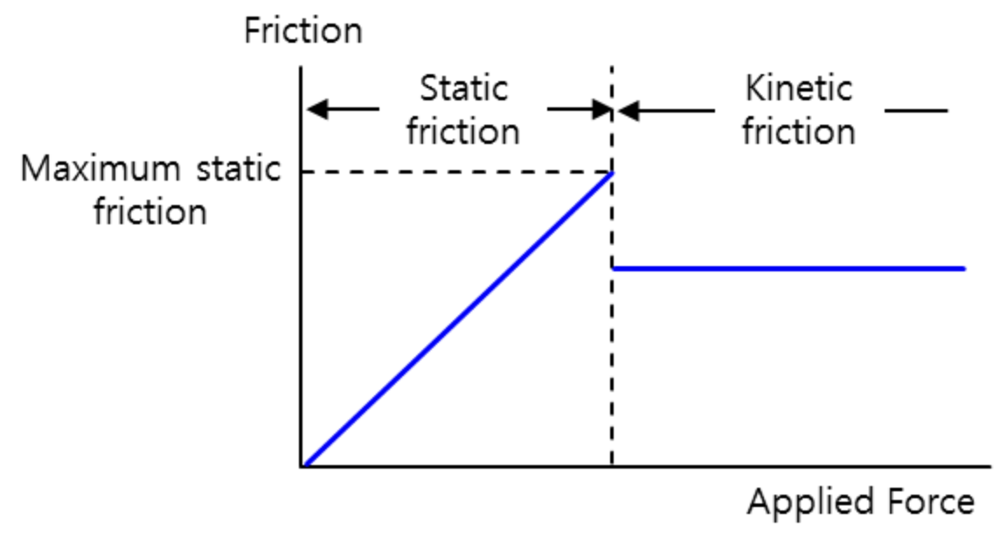

무언가 새로운 일을 시작하려고 마음을 먹었다가 실패한 적이 있지 않으신가요? 저는 사이드 프로젝트를 시작했다가 몇년동안 말만 했던 경험이 많이 있습니다. 최근에도 진행하려고 하는 프로젝트가 있는데, 처음 친구들과 단톡방을 만든 것이 거의 3년이 되었다는 사실을 알고 너무나 놀랐습니다.
우리가 사이드 프로젝트를 말로만 시작하고 말로 끝내는 이유는 무엇일까요? 어떻게 해야 처음 그 열정을 잃지 않고 결과물로 이어질 수 있을까요?

만 2년동안 말로만 개발하던 프로젝트를 하루만에 완성하게 된 저의 경험을 공유해드리려고 합니다.

### 2년간 말로만 했던 프로젝트
지금으로부터 3년 전쯤, 친구들과 모여 저녁을 먹던 중에 재미있는 프로젝트를 주제를 찾았습니다. 실제로 만들어보면 인생에 현실적인 도움이 될 수 있는 아이디어였습니다. 그날 저녁이 늦는지도 모르고 아이디어를 공유하며 열정 넘치게 프로젝트를 시작했습니다. 곧 바로 노션을 만들어 아이디어를 적고, 슬랙 메신저와 깃허브 조직을 만들었습니다. 개발할 수 있는 AWS 계정도 만들었습니다. 거창하게 시작하면 어려워 진다는 사실을 모두가 알았기 때문에 **시작부터 대단한 것을 만들지 말고 작은 것부터 시작하자는 이야기를 했습니다.** 린 스타트업에 익숙했기에 작지만 작동하는 무언가부터 만들자고 했습니다.

그러나 막상 첫 기능을 만들려고 자리에 앉으니 너무 많은 기술들이 떠올랐습니다. 처음에 만들려고 했던 것은 단순히 RSS 피드 하나를 크롤링해서 DB에 주기적으로 저장하는 기능이였습니다. 프로그래밍을 배울 때 예제로 나올법한 기능을 구현하는데도 여러가지 고민이 들었습니다. 가장 좋은 프로젝트 아키텍처는 무엇인지, 가장 좋은 환경은 무엇인지, 어떤 보안 정책을 적용해야 하는지, 성능 문제를 최소화 하는 좋은 방법은 무엇인지, CI/CD는 어떻게 구성할지 등등 어디선가 들어본 기술들이 머리에 가득해서 일을 시작하기 어려웠습니다. 기능을 만드는 것은 쉬웠습니다. 하지만 괜히 초보적인 방법을 사용하기 싫어서 온갖 기술들을 적용하려고 했습니다. 그렇게 작은 것 부터 시작하자는 말을 그렇게 많이 했는데도 불구하고 2년간 함수 하나를 띄우지 못했었습니다.

매주 주말에 카페에 가서 일을 시작하려 했지만 같은 일이 반복되었습니다. 이렇게 말로만 작업을 한지 2년이 지나는 어느 날, 번뜩 "그냥 나 혼자 한다고 생각하고 만들어보자" 라는 생각이 들었습니다. 주말에 노트북을 들고 카페에 나가 AWS에 접속했습니다. 가장 작은 ec2 인스턴스를 띄우고 SSH로 직접 접속해 무작정 도커로 DB 서버를 띄우고 당장 필요할 것 같은 테이블을 만들었습니다. 그런 후, AWS lambda 콘솔에서 아주 간단한 크롤러 하나를 만들어 ec2 데이터베이스에 연결해 크롤링한 정보가 쌓이도록 했습니다.

일단 시작을 하니 그날 이후부터 더 많은 것들을 빠르게 적용해볼 수 있었습니다. 크롤링 된 결과를 슬랙으로 보내는 함수를 하나 추가하고, 크롤링된 정보를 요즘 유행하는 LLM에 보내 요약하게 했습니다. 점차 기능을 하나씩 추가하다 보니 버전관리가 필요해졌고, 버전 관리를 하다보니 자동으로 배포되는 것이 필요해 졌습니다, 프로젝트가 커지다보니 관리를 편하게 해줄 프레임워크가 필요해졌고 이것도 도입했습니다. 일단 시작하니 그 다음은 생각만큼 쉽고 재미있었습니다. 이렇게 하루 아침에 지난 2년간 머리로만 생각하고 말로만 떠들던 기능을 만들수 있었습니다.

### 일을 시작하는 것은 어렵다
이렇게 쉬운 일을 2년간 막고 있던 것은 무엇일까요? 저는 완벽함을 추구하는 마음이라고 생각합니다. 완벽함을 추구하는 것은 일을 시작하기 어렵게 만듭니다.

우리가 아는 것과 할 수 있는 것에는 생각보다 많은 차이가 있습니다. 공부를 하거나 회사를 다니며 수 많은 기술들을 접하게 됩니다. 경험이 늘어날 수록 해본 것과 아는 것에 더 많은 차이가 생기게 됩니다. 아는게 많아질수록 내가 모든 것을 할 줄 알고 해야 한다는 생각에 빠지게 됩니다. 하지만 내가 아는 것이 곧 내 능력은 아닙니다. 아는 모든 것을 적용하려고 하면 너무나 많은 부담을 지게 됩니다.

저는 새로운 프로젝트를 시작할 때 '정지 마찰력'과 '운동 마찰력'을 떠올립니다. 우리가 무거운 상자를 끌어 옮길 때 처음 움직일때까지는 힘이 많이 들지만, 한번 움직이면 비교적 수월하게 되는 경험을 합니다. 이미 움직이고 있는 물체를 그대로 유지하는 것 보다, 멈추어 있는 물체를 움직이게 하는 것에 더 많은 방해를 받습니다. 마찬가지로 우리가 새로운 일을 시작하는 것이 이미 진행되고 있는 일을 지속하는 것 보다 훨신 어렵습니다. 일단 시작을 하는 것에도 충분히 힘을 써야 하는데, 완벽함을 추구하면 더욱 일을 시작하기가 어렵습니다.

### 능력의 10%만 사용하기
작심삼일을 막기 위해 작은 것 부터 시작하는 것이 중요하다는 것은 모두가 익히 들어보셨을 것입니다. 저는 작은 것 부터 시작하는 구체적인 방법으로 '능력의 10%만 사용하기' 원칙을 떠올리게 되었습니다.
지금 내가 알고 있는 것중 의도적으로 10%만 사용해보는 것입니다. 프로그래밍 프로젝트를 한다면, 마치 프로그래밍을 처음 배운 사람이 하듯이 해보는 것입니다. 
''능력의 10%만 사용하기' 원칙을 제대로 따르고 있다면 다음과 같은 느낌이 들 수 있습니다. 내가 짠 코드가 불편하고 마음에 들지 않습니다. 회사에서 이런식으로 프로젝트를 한다면 혼날수도 있겠다는 생각이 들 수도 있습니다. 친구에게 보여주기 부끄러운 코드와 아키텍쳐일 수 있습니다. 개발 커뮤니티에 올리면 수 많은 피드백과 '훈수'를 듣게 될 수도 있습니다. 심지어 이미 내가 알고있고 적용하려고 했던 기술들을 가지고 말이죠.
하지만 이렇게 일을 시작하게 되면 그 다음은 생각보다 수월할 것입니다. 점차 내가 생각했던 것들을 적용하면 됩니다.

혹시 지금도 마음을 먹었지만 행동으로 옮기지 못한 일이 있으신가요? 그러면 오늘 부담을 내려놓고 한 걸음 나아가 보시는 것은 어떨까요? 완벽하려고 하지 마세요 초보자처럼 한 걸음을 떼어 보세요.

