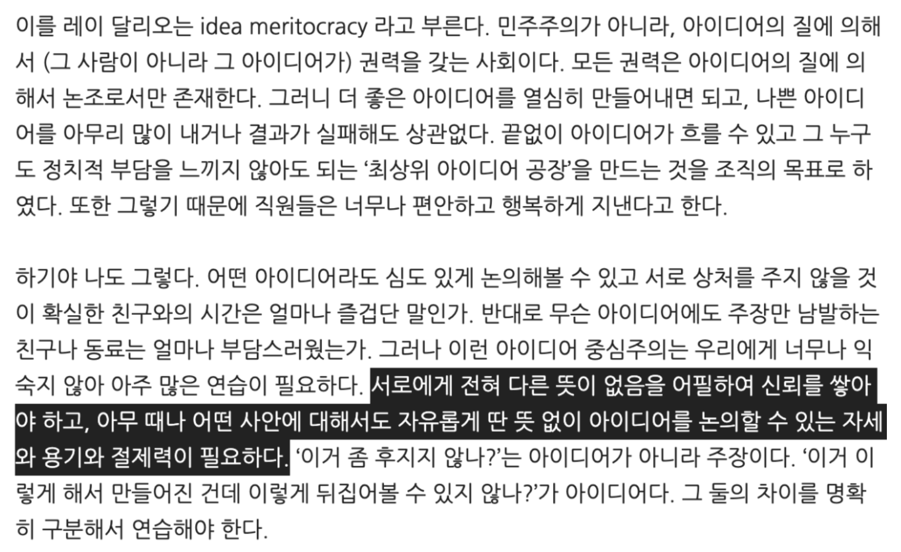

- 지식노동자인 우리가 하는 일의 대부분은 아이디어 관리이다. 이 시대에 아이디어는 산업화 시대의 원유(Oil)와 같다.
-   **우리 업계는 실패를 관리하는 것 보단 도전해서 파괴적 혁신을 이루는 것이 중요한 분야이기 때문**
	- 그래서 실무적으로도 말을 많이 하게 하는 것이 중요하다.
  	- 다양한 말이 나와야 한다.
  	- 다양한 말이 나와야 다양한 아이디어가 나온다.
- 군대, 병원, 교통분야, 원자력 발전소 등 안전, 생명과 직결된 분야는 실패를 관리하는 것이 중요하다.
- 하지만 하나의 혁신 아이디어의 탄생이 중요한 콘텐츠, 서비스 분야에서는 많은 도전을 강조하는 것이 중요하다.
- 또한, 상호간 피드백을 하며 성장하는 것이 조직 자체에 도움이 되는 길이기 때문
	- 이건 생명과 직결된 분야에도 통용되는 말
	- 그들이 실패와 문제를 숨긴다면? 대형 참사가 일어나는 것이다

## 아이디어를 위한

-   나쁜 아이디어를 많이 내거나 실패해도 상관 없다고 느끼게 만들기
-   다른 뜻이 없게 느끼게 만드는 것은 의도적으로 필요함
    -   사람은 원래 다른 뜻을 느끼기 마련
    -   다른 사람이 다른 뜻으로 느끼는 것을 그 사람 탓을 하면 안 됨
    -   말하는 사람이 잘 안다면 이것까지 책임질 필요가 있음 → 안 그렇게 느끼게 만들기
    -   이게 연습이 반복되면 팀이 치열한 토론을 할 수 있어짐

## 참고문서
- [Keep 'Em Coming: 첫번째 아이디어가 최고가 아닌 이유](https://news.hada.io/topic?id=7810&utm_source=slack&utm_medium=bot&utm_campaign=TBQCNK7SS)
- [레이 달리오의 원칙 중에서 아이디어 민주주의](https://ppss.kr/archives/186421)
- 아이디어 민주주의!
  - 